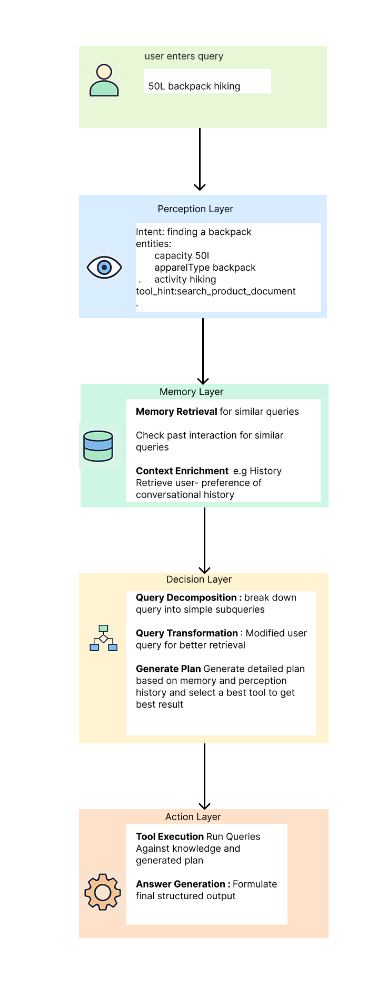

# Rise of Agentic AI and Birth of Model Context Protocol (MCP)

## The Evolution of AI: From Text Generation to Agentic Action

### 1. Early Limitations of LLMs
Initial Large Language Models (LLMs) were groundbreaking in their ability to generate human-like text. However, they lacked precise instruction-following capabilities, often providing irrelevant or generalized responses. For example:

- **User:** "Who is the president of the USA?"  
  **LLM:** "The most influential person in the world."

### 2. Enhanced Instruction Following with SFT and RLHF
To overcome these limitations, two critical methodologies emerged:

- **Supervised Fine-Tuning (SFT)**: Models were explicitly trained on human-generated responses aligned with specific instructions.
- **Reinforcement Learning from Human Feedback (RLHF)**: Models were further refined by human-ranked preferences, significantly enhancing relevance and coherence in generated responses.

### 3. Integrating Function Calling
As users began to require precise, factual, and real-time information, LLMs integrated external tool invocation capabilities (function calling). For instance:

- **User:** "What is the square root of 14.5232?"  
  **LLM (Function Calling):** "The square root of 14.5232 is approximately 3.81."

### 4. Emergence of Agentic AI
Demand for practical, real-world interactions led to the rise of Agentic AI—models capable of autonomously interacting with external applications and services to perform actions such as:

- Scheduling calendar events
- Sending messages
- Conducting online transactions

However, integrating with multiple diverse applications faced significant challenges, including:

- Diverse technology stacks
- Inconsistent API structures
- Complex authentication requirements
- Scalability issues with manual integrations


### 5. 📜 Birth of Model Context Protocol (MCP)

As AI assistants became more capable, they remained trapped by **information silos** — isolated from real-world data in business tools, repositories, and systems. Connecting models to data was messy: every new source needed **custom integration**, making scaling difficult.

To solve this, [Anthropic](https://www.anthropic.com/news/model-context-protocol) created **Model Context Protocol (MCP)** — an **open, universal standard** that connects AI models securely to data sources. Instead of building one-off connectors for each system, MCP lets AI tools and data systems **communicate through a single standardized protocol**.

MCP introduces:
- **MCP Servers**: Expose data securely to AI agents.
- **MCP Clients**: AI apps that connect to these servers to fetch or update data.
- **Pre-built MCP Connectors**: For tools like Google Drive, Slack, GitHub, Postgres.

This standardization helps models maintain **context** across different tools and datasets, enabling **more powerful, agentic AI systems** that retrieve, understand, and act on data in real time — **breaking free from silos**.

Key benefits of MCP include:
- Standardized interactions with databases, web services, and applications
- Dynamic tool invocation based on context, eliminating hardcoded integrations
- Simplified scalability across diverse ecosystems

### MCP in Action
Consider an MCP-powered AI handling a scheduling request:

- **User:** "Schedule a Zoom meeting tomorrow at 10 AM."  
  **AI (using MCP):**
  1. Recognizes intent and invokes a standardized scheduling function.
  2. Communicates with Zoom’s API via MCP-compliant interface (Zoom will provide Zoom Client server tools and capabilities)
  3. Retrieves meeting link and confirms: "Your Zoom meeting is scheduled for tomorrow at 10 AM. Here is the link: [meeting_link]."

# Agentic AI Integrated with MCP 

### Ecommerce Product Search RAG Agent with Model Context Protocol (MCP)

A smart RAG (Retrieval-Augmented Generation) agent built for E-commerce product search, It follows a structured cognitive design made up of four key steps: **Perception, Memory, Decision, and Action**. These steps help the agent think and act in a human-like way.
All parts are smoothly connected using something called the Model Context Protocol (MCP).

Overview
The RAG Agent helps users find products by understanding their questions and using advanced language and memory skills. It follows a clear thinking process, broken into steps, to make better decisions. It also uses the Model Context Protocol (MCP) to easily connect with different tools and complete tasks.


## Flowchart of 4 Cognitive layer function : Perception, Memory, Decision, Action

Architectural Flowchart

```mathamatica
User Query
    │
    ▼
┌─────────────┐          ┌─────────────┐          ┌─────────────┐          ┌─────────────┐
│ Perception  │─────────▶│   Memory    │─────────▶│  Decision   │─────────▶│   Action    │
└─────────────┘          └─────────────┘          └─────────────┘          └─────────────┘
    │                        │                        │                        │
    │                        │                        │                        │
Extracts Intent,        Retrieves Relevant       Determines Next       Executes Tools via
Entities & Tools          Past Context            Action or Answer             MCP
    │                        │                        │                        │
    ▼                        ▼                        ▼                        ▼
Structured Query         Contextual Data         Action Plan / Final     Tool Execution &
                                                    Answer               Response Handling
```


## Detailed Explanation of Cognitive Components of RAG AI Agent

### 1. Perception 🧠

The Perception component **interprets and structures raw user inputs.** It leverages **language models**(LLMs) to extract crucial information such as **intent, entities (product attributes), and potential tool suggestions** to guide the subsequent processes.

- **Purpose:** Convert user queries into structured, actionable data, Modified user query for if necessary.
- **Example:**
  ```json
  User Input: "50l backpack for hiking"
  Perception result: {                              
     "user_input": "50l backpack for hiking",      
     "modified_user_input": "50l hiking backpack", 
     "intent": "find a hiking backpack",           
     "entities": [                                 
         "Capacity:50l",                           
         "ProductType:backpack",                   
         "Activity:hiking"                         
     ],                                            
     "tool_hint": "search_product_documents"       
  }                                                
  ```
---

### 2. Memory 🧵

**Memory** stores **historical interactions, user preferences**, and relevant context using embeddings and semantic search techniques. It employs **FAISS** for efficient retrieval of similar past interactions based on current queries.

**Memory** Maintain a **conversation_history** and incrementally update the prompt, keeping the context fresh. This reinforces the idea that reasoning unfolded over multiple rounds.

- **Purpose:** Enhance context-awareness by recalling previous relevant information.
- **Example:**
  ```json
  User Query: "Waterproof hiking backpack"
  Memory Retrieval:
  [
    {
        "text": "Tool call: search_product_documents with {'query': '\"50L hiking backpack\",top_k=5'}, got: ['{\"id\": 4602, \"product_display_name\": \"Wildcraft Unisex Red Trailblazer Backpack\", \"display_categories\": \"Accessories\", \"product_descriptors\": {\"materials_care_desc\": {\"value\": \"Nylon Wipe with a clean dry cloth when needed\"}, \"size_fit_desc\": {\"value\": \"Height: 74 cm Width: 22 cm Depth: 32 cm\"}}}']",
        "type": "tool_output",
        "timestamp": "2025-04-28T20:28:57.656051",
        "tool_name": "search_product_documents",
        "user_query": "50l backpack for hiking",
        "tags": [
            "search_product_documents"
        ],
        "session_id": "session-1745890140"
    }
  ]
  ```
  ---

### 3. Decision 📋

The Decision component plays the role of a **"strategic planner"** inside  Ecommerce Product Search Agent.
Its main job is to **synthesize user inputs (from Perception) and contextual memory (from Memory)** to intelligently plan the next best action.

It does this by following a carefully designed prompt that guides the agent step-by-step toward making good decisions without wasting tool calls or returning incomplete answers.

### Carefully **designed prompt for Ecommerce Search Product RAG Agent**

```text
memory_texts = "\n".join(f"- {m.text}" for m in memory_items) or "None"
tool_context = f"\nYou have access to the following tools:\n{tool_descriptions}" if tool_descriptions else ''"

    
prompt="""
You are Ecommerce Product Finder/Search Agent. Your job is to recommend products or help user find the right product based on their search query. You can use tools to search for products if needed and continue until the FINAL_ANSWER is produced.{tool_context}

Always follow this loop:

1. Think step-by-step about the problem.
2. If the user query is unclear, modify the query concisely, focusing only on product attributes, entities, or metadata.
     e.g If user query is "Puma T-shirt for casual wear for female under 18"
    - Modify query could be "BrandName Puma, Appreal - T-shirt, Comfort casual Gender female Age group under 18" or similarly you can modify query to focus only on product attributes, entities, or metadata.
3. If a tool is needed, respond using the format:
   FUNCTION_CALL: tool_name|param1=value1|param2=value2
4. When the retrieval result is known, refine or rerank the results based on relevance to the user query. Use tools like `product_metadata_analysis_for_refine_or_tuning_search_result`, `preety_print_product_metadata_response` if needed.
5. If you call `preety_print_product_metadata_response`, you should receive a string representation of a list of ProductMetadataSubset objects. ⛔ IMMEDIATELY stop further steps and respond with:
   FINAL_ANSWER: [<output of preety_print_product_metadata_response>]
6. Do NOT call `search_product_documents` again with the same query unless previous output was empty or irrelevant.
7. Respond using EXACTLY ONE of the formats above per step. Do NOT include any explanation, commentary, or other text outside tool or FINAL_ANSWER formats.

✅ Strict Finalization Rule:
- 🚨 If you call `preety_print_product_metadata_response`, your VERY NEXT and FINAL response MUST be:
  FINAL_ANSWER: [<output of preety_print_product_metadata_response>]
  🔁 Do NOT continue the loop. END LOOP here.

Guidelines:
- Only repeat `search_product_documents` if the last result was irrelevant, empty, or not yet called.
- ❌ Do NOT repeat function calls with the same parameters.
- ❌ Do NOT output unstructured responses.
- If the user query is not clear or needs refinement, rewrite the query in terms of product attributes, entities, brands, or metadata — no verbose changes.
- 🧠 Think before each step. Verify intermediate results mentally before proceeding.
- 🧠 If factual information is already available from the last tool, summarize and go directly to FINAL_ANSWER without calling tools again.
- 💥 If no tool fits or data is insufficient, respond with: FINAL_ANSWER: [unknown]
- ✅ You have only 3 - 5 attempts. The final attempt MUST be a FINAL_ANSWER.
- ✅ Once you call `preety_print_product_metadata_response`, DO NOT call any tool after. Go to FINAL_ANSWER immediately using its result.

Input Summary:
- User input: "{perception.user_input}"
- Intent: {perception.intent}
- Entities: {', '.join(perception.entities)}
- Tool hint: {perception.tool_hint or 'None'}

Relevant Memories:
{memory_texts}

✅ Examples:
- FUNCTION_CALL: search_product_documents|query="Nike T-shirt for Men",top_k=5
- FUNCTION_CALL: product_metadata_analysis_for_refine_or_tuning_search_result
- FUNCTION_CALL: return_ranked_product_response_from_ranked_index|product_responses=[ProductResponse(...)],ranked_indices=[0,1]
- FUNCTION_CALL: preety_print_product_metadata_response|product_response_list=[ProductResponse(...)]
- FINAL_ANSWER: [<output of preety_print_product_metadata_response>]

⛔ Wrong Examples:
- Any text mixed with tool or FINAL_ANSWER
- Repeating tool calls with same params
- Skipping FINAL_ANSWER after pretty print

✅ Final Checklist:
- If you call search_product_documents when earlier query did not return good results, make sure to modify query to focus only on product attributes, entities, or metadata to better match the query.
- Did you call `preety_print_product_metadata_response`? → Then you MUST respond next with FINAL_ANSWER.
- VERY IMPORTANT: If you Call `preety_print_product_metadata_response` tool -> Instead, use the result and end with FINAL_ANSWER.
- Are you about to call another tool after pretty print? → ❌ DON’T. Instead, use the result and end with FINAL_ANSWER.
"""
```
---

### ✨ Key Steps the Decision Component Follows

1. **Understand the Problem:**  
   Think step-by-step about the user query and available memory/context.
   
2. **Refine the Query if Needed:**  
   If the user's input is vague (e.g., "good hiking bag"), modify it into a clear set of product attributes and metadata (e.g., `"Backpack | Waterproof | 50L | Hiking"`).

3. **Plan the Next Action:**  
   Decide whether to:
   - Call a **tool** (e.g., `search_product_documents`) with a well-formed query.
   - Directly generate a **FINAL_ANSWER** if enough information is available.

4. **Select Tools Carefully:**  
   When a tool is needed:
   - Respond with a `FUNCTION_CALL:` in the exact format.
   - Never repeat tool calls unless previous results were empty or bad.
   - After calling `preety_print_product_metadata_response`, immediately end with `FINAL_ANSWER:` — no further steps.

5. **Finalize Intelligently:**  
   - If results are satisfactory (especially after pretty print), immediately return a FINAL_ANSWER.
   - If no useful results exist even after attempts, safely fallback with `FINAL_ANSWER: [unknown]`.

6. **Follow the Strict Loop:**  
   The prompt enforces no explanations, no extra text, no repetition, and a strict maximum number of steps (3–5).

---

## 🧩 How the Prompt Helps Decision-Making

- **Clear Role Definition:**  
  Defines the agent's job: Help find products or recommend based on user needs.
  
- **Structured Thinking:**  
  Forces the agent to reason step-by-step before taking any action.

- **Action Planning Format:**  
  Forces clean output using strict formats like:
  ``` 
  Plan Generated FUNCTION_CALL: search_product_documents|query="50L hiking backpack",top_k=5

  ```
  or
  ```
  FINAL_ANSWER: [<final output>]
  ```
  or 
  ```
  Plan generated: FUNCTION_CALL: preety_print_product_metadata_response|product_response_list=[]
  ```

- **Memory Utilization:**  
  Provides recent memories and past tool outputs to think smarter instead of blind retries.

- **Error Prevention:**  
  Includes strict guards against:
  - Redundant tool calls
  - Skipping FINAL_ANSWER
  - Mixing text with tool commands
  - Calling tools after pretty print

- **Failsafe Mechanisms:**  
  If nothing fits, always fall back to `FINAL_ANSWER: [unknown]`.

---

## 🎯 What a Good Decision Output Looks Like

- **First Step:**  
  Think: "Is the user query clear?" → If not, refine it.
  
- **Second Step:**  
  Choose the right tool → Search, refine, or pretty-print.

- **Third Step:**  
  Based on tool results → If good, finalize with FINAL_ANSWER; if not, retry (only with improvements).

- **Strict Ending:**  
  After `preety_print_product_metadata_response`, **stop** and respond with FINAL_ANSWER immediately.

---

### 4. Action 🛠️

Action executes the strategic decisions formulated previously. It involves **dynamically calling MCP-integrated external tools**, handling responses, and integrating outputs back into the cognitive flow.

- **Purpose:** Execute planned actions, retrieve results, and finalize outputs.
- **Example:**
  ```json
  Tool Cool: Calling 'search_product_documents' with: {'query': '"50L hiking backpack",top_k=5'} 
  Response:
  [
    search_product_documents returned: ['{"id": 4602, "product_display_name": "Wildcraft Unisex Red Trailblazer,Backpack", "display_categories": "Accessories"}','{"id": 1024, "productDisplayName": "Mountain Trekker 50L Waterproof Backpack", "price": 120.00},']
  ]
  ```


---

## MCP Integration
**MCP** standardizes interactions with external tools, providing a unified interface for **dynamic execution and structured communication.**

---
The Model Context Protocol acts like a smart control center. It helps the **agent manage its memory, tools, and actions smoothly.**

With MCP, the agent can:
1. Easily understand what tools are available
2. Decide when and how to use external tools (like search engines or rerankers)
3. Keep the full conversation and decision process organized
4. Move between Perception → Memory → Decision → Action seamlessly

In short, MCP makes sure all cognitive layers work together in the right way to deliver accurate and fast product search results.

### Final Response for 

```json
"user_input" : "50l backpack for hiking"

[
  {
    "id": 1556,
    "price": 2199.0,
    "fashionType": "Fashion",
    "productDisplayName": "Quechua Forclaz Large Backpack - 50 ltr Orange",
    "variantName": "Forclaz Large",
    "displayCategories": "Accessories and Clearance, Sale and Clearance, Accessories, Sale"
  },
  {
    "id": 4602,
    "price": 4299.0,
    "fashionType": "Core",
    "productDisplayName": "Wildcraft Unisex Red Trailblazer Backpack",
    "variantName": "Trailblazer Red",
    "displayCategories": "Accessories"
  },
  {
    "id": 39506,
    "price": 3799.0,
    "fashionType": "Fashion",
    "productDisplayName": "Peter England Unisex Black & Green Hiking Backpack",
    "variantName": "HIKING BAG",
    "displayCategories": "Accessories"
  },
  {
    "id": 51317,
    "price": 5699.0,
    "fashionType": "Fashion",
    "productDisplayName": "Wildcraft Unisex Orange Alpinist 55 Backpack",
    "variantName": "Alpinist 55 Orange",
    "displayCategories": "Accessories"
  },
  {
    "id": 32864,
    "price": 1395.0,
    "fashionType": "Fashion",
    "productDisplayName": "Wildcraft Unisex Pink & Grey Backpack",
    "variantName": "Reflex",
    "displayCategories": "Accessories"
  }
]

```

```
Technical Highlights

**Structured Cognitive Layers:** Clear separation between perception, memory, decision, and action.

**FAISS & Embedding:** Efficient semantic memory retrieval.

**MCP Integration:** Universal protocol for executing external tools dynamically.

**Pydantic Models:** Strict data validation and structured communication across cognitive layers.

.
├── action.py           # Executes planned actions via MCP
├── agent.py            # Entry point for the RAG Agent
├── decision.py         # Generates decision/action plans based on inputs
├── log_utils.py        # Rich logging utilities for structured logs
├── mcp_server.py       # MCP Server implementation
├── memory.py           # Memory management using FAISS
├── models.py           # Data models for structured data exchange
└── perception.py       # Extracts structured perception data from user inputs
```


### Logs 

```log
🧑 What Product do you want to find Today? → [agent] Starting agent...
[agent] current working directory:  /Users/chiragtagadiya/MyProjects/EAG1/RAG-MCP
Connection established, creating session...
[agent] Session created, initializing...
[agent] MCP session initialized
Available tools: ['preety_print_product_metadata_response', 'return_ranked_product_response_from_ranked_index', 'product_metadata_analysis_for_refine_or_tuning_search_result', 'add', 'sqrt', 'subtract', 'multiply', 'divide', 'power', 'cbrt', 'factorial', 'log', 'remainder', 'sin', 'cos', 'tan', 'create_thumbnail', 'strings_to_chars_to_int', 'int_list_to_exponential_sum', 'fibonacci_numbers', 'search_product_documents']
Requesting tool list...
╭─── 🤖 AGENT ────╮
│ 21 tools loaded │
╰─── 20:26:11 ────╯
╭─── 🔁 LOOP ────╮
│ Step 1 started │
╰─── 20:26:11 ───╯
╭──────────────────── 🧠 PERCEPTION ────────────────────╮
│ Perception result: {                                  │
│     "user_input": "50l backpack for hiking",          │
│     "modified_user_input": "50l backpack for hiking", │
│     "intent": "find a backpack",                      │
│     "entities": [                                     │
│         "Capacity:50l",                               │
│         "ApparelType:backpack",                       │
│         "Activity:hiking"                             │
│     ],                                                │
│     "tool_hint": "search_product_documents"           │
│ }                                                     │
╰────────────────────── 20:26:12 ───────────────────────╯
╭────────── 🧵 MEMORY ──────────╮
│ Retrieved 0 relevant memories │
╰────────── 20:26:12 ───────────╯
╭──────────────────────────────────────────────────────────────── 📋 PLAN ─────────────────────────────────────────────────────────────────╮
│ LLM output: Okay, I understand. The user is looking for a 50L backpack for hiking. I need to use the `search_product_documents` tool to  │
│ find relevant products.                                                                                                                  │
│                                                                                                                                          │
│ FUNCTION_CALL: search_product_documents|query="50L backpack hiking",top_k=5                                                              │
╰──────────────────────────────────────────────────────────────── 20:26:13 ────────────────────────────────────────────────────────────────╯
╭────────────────────────────────────────── 📋 PLAN ──────────────────────────────────────────╮
│ Plan generated: FUNCTION_CALL: search_product_documents|query="50L backpack hiking",top_k=5 │
╰───────────────────────────────────────── 20:26:13 ──────────────────────────────────────────╯
╭────────────────────────────────── 🧩 PARSER ──────────────────────────────────╮
│ Parsed: search_product_documents → {'query': '"50L backpack hiking",top_k=5'} │
╰────────────────────────────────── 20:26:13 ───────────────────────────────────╯
╭─────────────────────────────────────── 🛠️ TOOL ────────────────────────────────────────╮
│ ⚙️ Calling 'search_product_documents' with: {'query': '"50L backpack hiking",top_k=5'} │
╰────────────────────────────────────── 20:26:13 ───────────────────────────────────────╯
```